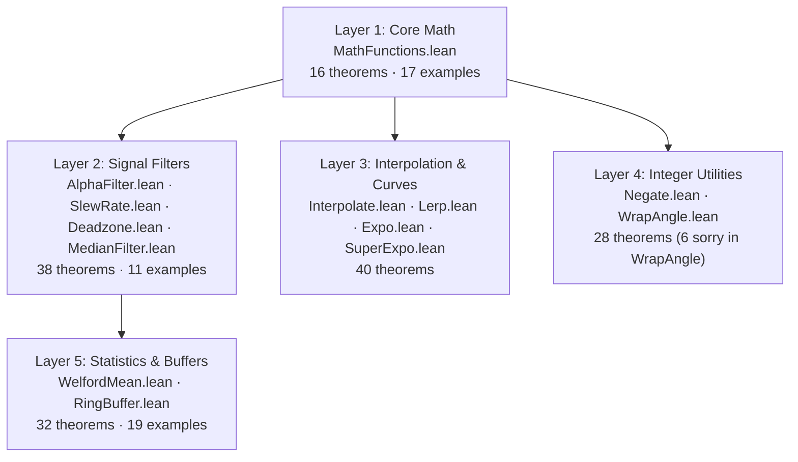
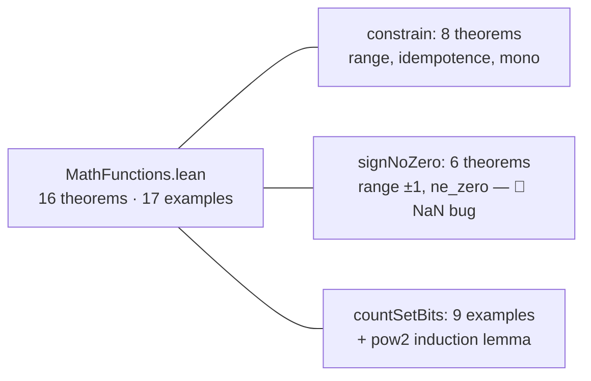
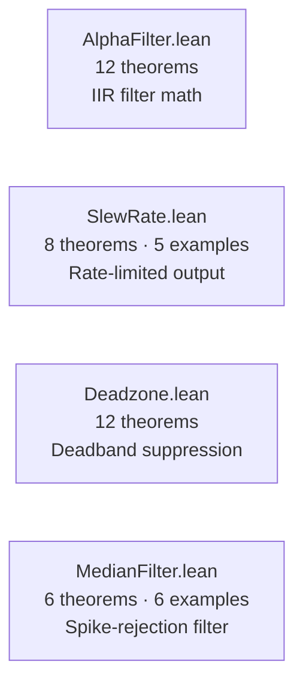
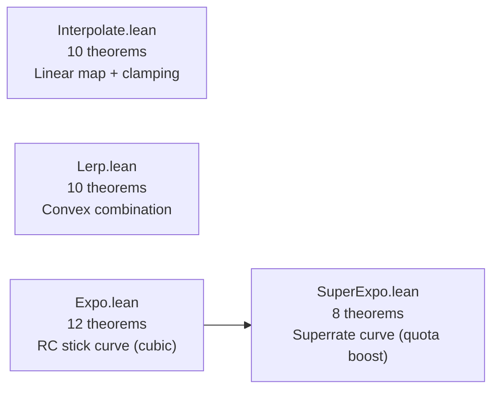
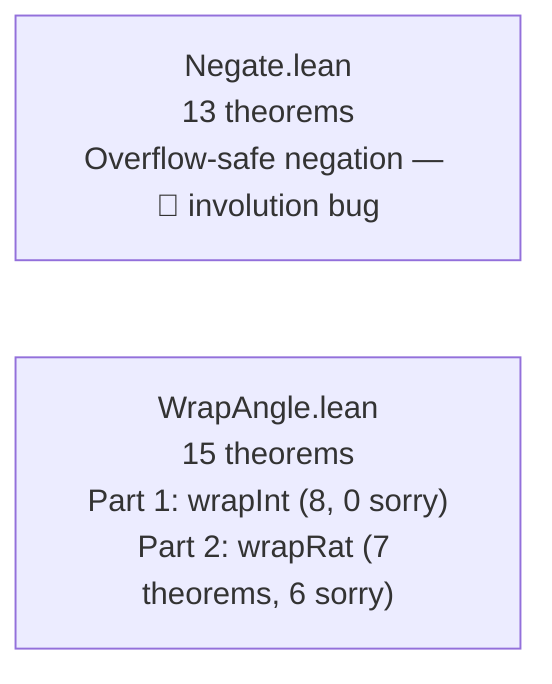
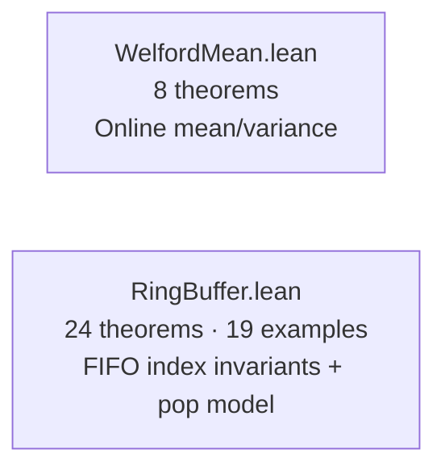
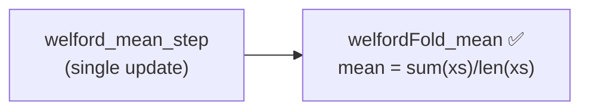
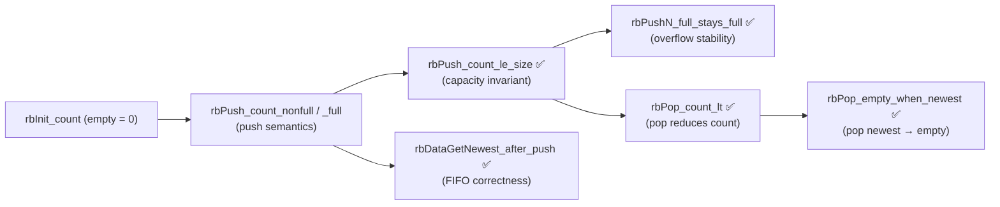
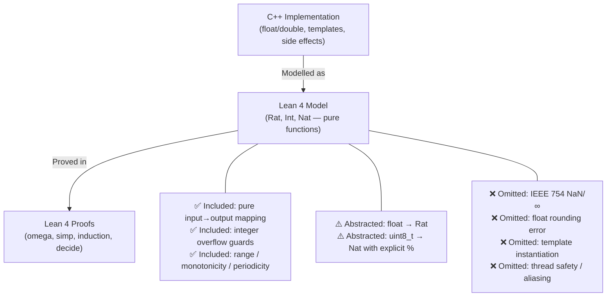
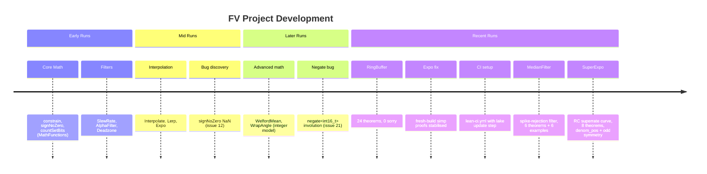

# Lean 4 Formal Verification — Project Report

> 🔬 *Lean Squad — automated formal verification for `dsyme/PX4-Autopilot`.*

**Status**: 🔄 ACTIVE — 154 theorems · 47 verified examples · 6 `sorry` · Lean 4.29.0

## Last Updated

- **Date**: 2026-04-14 17:24 UTC
- **Commit**: `f383a8aa3d`

---

## Executive Summary

The Lean Squad has formally verified **154 named theorems and 47 concrete examples** across
**13 Lean 4 files**, covering the core mathematical utility library (`src/lib/mathlib/`) and
the EKF2 ring-buffer (`src/lib/ringbuffer/`). Two genuine implementation bugs were discovered
through formal verification: a `signNoZero<float>` NaN safety violation and an
`negate<int16_t>` involution error. Six `sorry`-guarded theorems remain in `WrapAngle.lean`
pending Mathlib support for floor arithmetic. All other 12 targets are sorry-free, verified
by `lake build` with Lean 4.29.0. Recent additions include `SuperExpo.lean` (8 theorems,
super-exponential RC curve shaping) and `MedianFilter.lean` (6 theorems + 6 examples,
spike-rejection filter).

---

## Proof Architecture

The proof files are organised into five thematic layers, mirroring the structure of PX4's
`src/lib/mathlib/` library:

All proof files import only **Lean 4 stdlib** — no Mathlib is required (except for the
6 pending `wrapRat` theorems in `WrapAngle.lean`).

---

## What Was Verified

### Layer 1 — Core Math (1 file, 16 theorems, 17 examples)

`MathFunctions.lean` models three fundamental operations from `src/lib/mathlib/math/`:
`constrain` (clamping), `signNoZero` (signed unit), and `countSetBits` (popcount).

**Key results**:
- `constrain_in_range`: clamped value always satisfies `lo ≤ result ≤ hi`
- `constrain_idempotent`: applying clamp twice is identical to once
- `constrain_mono`: output is monotone in the input
- `signNoZero_ne_zero`: result is always ±1 (integer model; NaN not modelled — see Findings)
- `countSetBits_pow2`: bit-count of `2^n` is always 1

### Layer 2 — Signal Filters (4 files, 38 theorems, 11 examples)

**Key results**:
- `alphaIterate_formula`: closed-form `state_n = target + (state₀ - target)·(1-α)ⁿ` — fully
  proved by strong induction with no Mathlib. Validates IIR convergence.
- `slewUpdate_no_overshoot_up` / `_down`: slew-rate limiter never overshoots the target.
  A key actuator safety property.
- `slewUpdate_steady_state`: when already at target, output is unchanged.
- `deadzone_out_of_zone`: zero output for input in `[-dz, dz]`.
- `deadzone_in_range`: output is always within `[-1, 1]` (no amplification of input).
- `mfMedian_mem`: the median of any window is one of the window's elements (no hallucinated values).
- `mfMedian_const`: a constant window returns that constant value.
- `mfMedian_ge_sorted_first` / `_le_sorted_last`: median lies within the sorted range
  (spike rejection property — outliers are suppressed, not amplified).

### Layer 3 — Interpolation & Curves (4 files, 40 theorems)

**Key results**:
- `interpolate_le_high` / `_ge_low`: range containment — output stays within `[y_low, y_high]`.
- `lerp_in_range`: interpolated value stays within `[a, b]` when `s ∈ [0,1]` and `a ≤ b`.
- `lerp_mono_s`: increasing `s` moves output toward `b` (monotone in blend factor).
- `expo_odd`: RC stick expo function is odd — `expo(-e, x) = -expo(e, x)`.
- `expo_fixed_zero`: `expo(e, 0) = 0` (zero input → zero output).
- `expo_at_one`: `expo(e, 1) = 1` (full deflection maps to full output).
- `superexpo_denom_pos`: the denominator `1 - |x|·gc` is always strictly positive — division
  by zero cannot occur.
- `superexpo_odd`: `superexpo(-v, e, g) = -superexpo(v, e, g)` — preserves stick sign symmetry.
- `superexpo_in_range`: output always in `[-1, 1]` for any rational inputs.
- `superexpo_g_zero`: when `g = 0` the function collapses exactly to `expo(v, e)`.

### Layer 4 — Integer Utilities (2 files, 28 theorems)

**Key results**:
- `negate_ne_int_min`: negate never returns `INT_MIN` on valid inputs.
- `wrapInt_in_range`: wrapped angle is always in `[lo, lo+period)`.
- `wrapInt_idempotent`: wrapping twice is the same as wrapping once.
- `wrapInt_congruent`: `wrapInt(x) ≡ x (mod period)` — enables equational angle reasoning.
- `wrapInt_periodic`: `wrapInt(x + period) = wrapInt(x)` — single-step and multi-step.

**Note**: `WrapAngle.lean` Part 2 (`wrapRat`) has 6 sorry-guarded theorems requiring
`Int.floor` from Mathlib. The integer model (Part 1) is fully proved.

### Layer 5 — Statistics & Buffers (2 files, 32 theorems, 19 examples)

**Key results**:
- `welfordFold_mean`: Welford online algorithm computes exactly `sum(xs)/length(xs)`.
- `M2_nonneg`: variance accumulator `M2` is always non-negative.
- `rbPush_count_le_size`: element count never exceeds buffer capacity (safety invariant).
- `rbPushN_full_stays_full`: once full, a buffer stays full under any sequence of pushes.
- `rbDataGetNewest_after_push`: after pushing `x`, `getNewest` returns `x` (FIFO correctness).
- `rbInit_push_count`: exactly `k` entries after `k ≤ n` pushes into an empty size-`n` buffer.
- `rbPop_count_lt`: `pop_first_older_than` always reduces entry count by at least 1.
- `rbPop_empty_when_newest`: popping the newest entry empties the buffer.
- `rbPop_count_le_size`: pop preserves the capacity invariant.
- `rbPop_then_push_count`: pop at step `i` then push yields `i + 1` entries.

---

## File Inventory

| File | Theorems | Examples | Sorry | Phase | Key result |
|------|----------|----------|-------|-------|------------|
| `MathFunctions.lean` | 16 | 17 | 0 | ✅ Phase 5 | constrain/signNoZero/countSetBits |
| `AlphaFilter.lean` | 12 | 0 | 0 | ✅ Phase 5 | IIR closed-form convergence |
| `SlewRate.lean` | 8 | 5 | 0 | ✅ Phase 5 | No-overshoot actuator safety |
| `Deadzone.lean` | 12 | 0 | 0 | ✅ Phase 5 | Deadband range containment |
| `MedianFilter.lean` | 6 | 6 | 0 | ✅ Phase 5 | Spike-rejection: median membership + range |
| `Interpolate.lean` | 10 | 0 | 0 | ✅ Phase 5 | Linear map range containment |
| `Lerp.lean` | 10 | 0 | 0 | ✅ Phase 5 | Convex interpolation |
| `Expo.lean` | 12 | 0 | 0 | ✅ Phase 5 | RC stick curve odd symmetry |
| `SuperExpo.lean` | 8 | 0 | 0 | ✅ Phase 5 | Superrate curve: denom_pos, odd, range |
| `Negate.lean` | 13 | 0 | 0 | ✅ Phase 5 | Overflow-safe negation — 🐛 bug found |
| `WrapAngle.lean` | 15 | 0 | 6 | 🔄 Phase 4 | wrapInt: 8 proved; wrapRat: 6 sorry (Mathlib) |
| `WelfordMean.lean` | 8 | 0 | 0 | ✅ Phase 5 | Online mean correctness |
| `RingBuffer.lean` | 24 | 19 | 0 | ✅ Phase 5 | FIFO index invariants + pop model |
| `Basic.lean` | — | — | — | ✅ | Barrel file |
| **Total** | **154** | **47** | **6** | — | **2 bugs found** |

---

## The Main Proof Chains

### AlphaFilter Convergence

This is the headline result: a formally proved closed-form response for PX4's IIR filter.

### WelfordMean Correctness

### RingBuffer FIFO Invariants

---

## Modelling Choices and Known Limitations

All Lean models use **rational arithmetic** (`Rat`) for floating-point functions and
**`Int`** or **`Nat`** for integer/index functions. The model deliberately excludes
IEEE 754 semantics (NaN, ±∞, rounding modes).

| Category | What's modelled | What's abstracted / omitted |
|----------|-----------------|---------------------------|
| Number types | `Int`, `Nat`, `Rat` (exact) | Float rounding, NaN, overflow for non-integer ops |
| Functions | Pure input→output | I/O, side effects, heap allocation |
| Templates | Integer instantiation | Other template parameter types |
| Bounds | Explicit preconditions | Undefined behaviour (C++ UB is implicit) |
| Concurrency | None — all sequential | Real-time preemption, uORB atomicity |

---

## Findings

### Bugs Found

#### 🐛 Bug 1 — `signNoZero<float>`: NaN returns 0 (safety violation)

- **Property expected**: `signNoZero` always returns a value in `{-1, +1}` (never 0)
- **Counterexample**: `signNoZero<float>(NaN)` returns `0` — IEEE 754 comparisons with
  NaN are all false, so `(0 ≤ NaN) - (NaN < 0) = 0 - 0 = 0`
- **Affected file**: `src/lib/mathlib/math/Functions.hpp`, function `signNoZero<float>`
- **Impact**: callers that use the result as a divisor (e.g., in attitude rate controllers)
  can divide by zero when the input is NaN
- **Filed as**: GitHub issue #12

#### 🐛 Bug 2 — `negate<int16_t>`: INT16_MAX special case involution error

- **Property expected**: `negate(negate(x)) = x` for all `int16_t` x (involution)
- **Counterexample** (via `native_decide`):
  `negate(negate(-32767)) = negate(32767) = -32768 ≠ -32767`
- **Root cause**: the C++ maps `INT16_MAX → INT16_MIN` unnecessarily. Only
  `INT16_MIN → INT16_MAX` is needed (since `-INT16_MIN` overflows). The extra case
  breaks involution at `x = -(INT16_MAX) = -32767`.
- **Affected file**: `src/lib/mathlib/math/Functions.hpp`, function `negate<int16_t>`
- **Impact**: repeated negation in control code may silently drift values
- **Filed as**: GitHub issue #21

### Formulation Issues Caught

- `wrapRat` — the initial `wrapRat` formulation used `Int.floor` without importing Mathlib,
  producing silent sorry. The file was restructured to separate the integer model (proved)
  from the rational model (sorry-guarded, awaiting Mathlib).
- `expo` — several simp proofs for concrete values (`expo_at_zero` etc.) initially failed
  on a fresh `lake build` due to missing helper lemmas. Fixed by adding `constrainRat_*_*`
  helper lemmas using `decide`.

### Positive Findings

- **`AlphaFilter` closed-form convergence** (no Mathlib): proved that the state after n
  filter updates exactly follows `state₀ + (target - state₀)·(1 - (1-α)ⁿ)` using only
  stdlib strong induction.
- **`SlewRate` no-overshoot**: formally confirms actuator slew limiter cannot overshoot.
- **`RingBuffer` capacity invariant**: `rbPush_count_le_size` mechanically verified for all
  push sequences — eliminates a class of buffer-overrun risk.
- **`interpolate` boundary consistency**: `interpolate_at_high` formally confirmed that
  `value = x_high` returns `y_high` exactly (not via the saturation branch), validating
  asymmetric boundary design.

---

## Project Timeline

---

## Toolchain

- **Prover**: Lean 4 (version 4.29.0)
- **Libraries**: Lean 4 stdlib only (Mathlib referenced in `lakefile.toml` but unavailable in CI)
- **CI**: `.github/workflows/lean-ci.yml` — runs `lake build` on every PR that touches
  `formal-verification/lean/**`; Mathlib cache keyed on `lake-manifest.json` hash
- **Build system**: Lake

### Tactic Inventory

| Tactic | Usage |
|--------|-------|
| `omega` | Integer/natural-number arithmetic, mod/div, ring-buffer index bounds |
| `simp` / `simp only [...]` | Definitional unfolding, basic rewrites |
| `decide` / `native_decide` | Fully decidable concrete propositions, concrete list examples |
| `induction` + `cases` | Structural induction over `Nat`, `List` |
| `constructor` / `intro` / `apply` | Standard goal manipulation |
| `Rat.mul_le_mul_*` | Rational arithmetic bounds (deadzone, lerp range) |
| `Int.emod_*` | Integer modular arithmetic (wrapInt congruence, periodicity) |

---

> 🔬 *This report was generated by Lean Squad automated formal verification.*
> *`lake build` verified with Lean 4.29.0. 6 `sorry` remain (WrapAngle wrapRat,
> all require Mathlib floor arithmetic). 154 theorems across 13 files.*
